# 빌드 검증 기록

## 2026-07-13

### AssetReferenceInspector Editor Plugin 골격

#### 대상

- 프로젝트: `Portfolio_PlugIn`
- 타깃: `Portfolio_PlugInEditor`
- 플랫폼: `Win64`
- 구성: `Development`
- Engine: Unreal Engine 5.4

#### 명령

```powershell
& "C:\Program Files\Epic Games\UE_5.4\Engine\Build\BatchFiles\Build.bat" Portfolio_PlugInEditor Win64 Development -Project="C:\UE5_Portfolio\Portfolio_UE5.4_verGit\Portfolio_PlugIn\Portfolio_PlugIn.uproject" -WaitMutex -FromMsBuild
```

#### 결과

성공.

UBT 출력 기준:

```text
[1/4] Compile [x64] AssetReferenceInspectorModule.cpp
[2/4] Link [x64] UnrealEditor-AssetReferenceInspector.lib
[3/4] Link [x64] UnrealEditor-AssetReferenceInspector.dll
[4/4] WriteMetadata Portfolio_PlugInEditor.target
Total execution time: 4.38 seconds
```

#### 확인 범위

- Demo Host Editor Target 빌드 확인
- `AssetReferenceInspector` Editor Plugin 최소 골격 포함 상태에서 빌드 확인

### AssetReferenceInspector Nomad Tab 등록

#### 대상

- 프로젝트: `Portfolio_PlugIn`
- 타깃: `Portfolio_PlugInEditor`
- 플랫폼: `Win64`
- 구성: `Development`
- Engine: Unreal Engine 5.4

#### 명령

```powershell
& "C:\Program Files\Epic Games\UE_5.4\Engine\Build\BatchFiles\Build.bat" Portfolio_PlugInEditor Win64 Development -Project="C:\UE5_Portfolio\Portfolio_UE5.4_verGit\Portfolio_PlugIn\Portfolio_PlugIn.uproject" -WaitMutex -FromMsBuild
```

#### 결과

성공.

UBT 출력 기준:

```text
Target is up to date
Total execution time: 0.77 seconds
```

#### 확인 범위

- `AssetReferenceInspector` 모듈에 Nomad Tab Spawner 등록/해제 코드 포함 상태에서 빌드 확인
- `SDockTab`, `SBox`, `STextBlock` 기반 최소 Slate 콘텐츠 포함 상태에서 빌드 확인

#### 미확인

- 메뉴/툴바 진입점은 이번 피처 범위가 아니므로 에디터 UI에서 직접 탭을 여는 검증은 수행하지 않음

### AssetReferenceInspector 에디터 창 열기

#### 대상

- 프로젝트: `Portfolio_PlugIn`
- 타깃: `Portfolio_PlugInEditor`
- 플랫폼: `Win64`
- 구성: `Development`
- Engine: Unreal Engine 5.4

#### 명령

```powershell
& "C:\Program Files\Epic Games\UE_5.4\Engine\Build\BatchFiles\Build.bat" Portfolio_PlugInEditor Win64 Development -Project="C:\UE5_Portfolio\Portfolio_UE5.4_verGit\Portfolio_PlugIn\Portfolio_PlugIn.uproject" -WaitMutex -FromMsBuild
```

#### 결과

성공.

일반 실행은 UBT 로그 파일 백업 단계에서 `UnauthorizedAccessException`으로 실패했다. 동일 명령을 권한 상승으로 재실행해 실제 컴파일/링크를 확인했다.

UBT 출력 기준:

```text
[2/7] Compile [x64] AssetReferenceInspectorCommands.cpp
[4/7] Compile [x64] AssetReferenceInspectorModule.cpp
[5/7] Link [x64] UnrealEditor-AssetReferenceInspector-0002.lib
[6/7] Link [x64] UnrealEditor-AssetReferenceInspector-0002.dll
[7/7] WriteMetadata Portfolio_PlugInEditor.target
Total execution time: 5.47 seconds
```

#### 확인 범위

- `FAssetReferenceInspectorCommands` 추가 상태에서 빌드 확인
- `FUICommandList` 기반 메뉴 Command 매핑 포함 상태에서 빌드 확인
- `ToolMenus` 기반 `LevelEditor.MainMenu.Window` 메뉴 진입점 등록 코드 포함 상태에서 빌드 확인
- 메뉴 Command에서 `FGlobalTabmanager::TryInvokeTab` 호출 코드 포함 상태에서 빌드 확인

#### 에디터 UI 확인

- Window 메뉴 클릭 후 `Asset Reference Inspector` 탭 오픈 확인
- 탭 내부 중앙에 `Asset Reference Inspector` 텍스트 표시 확인

#### Screenshots

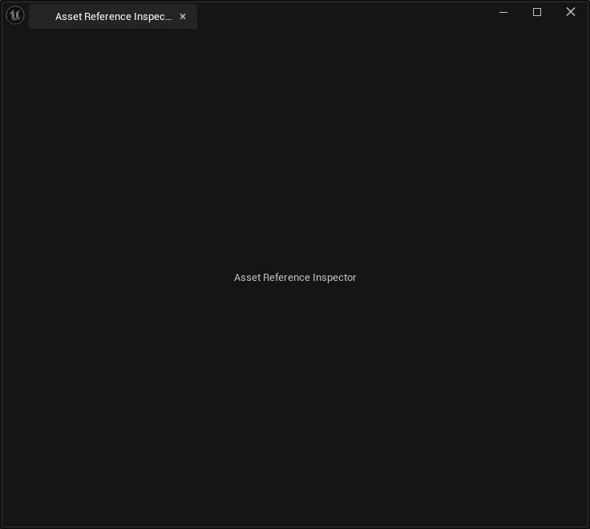

### AssetReferenceInspector Commands Public API 정리

#### 대상

- 프로젝트: `Portfolio_PlugIn`
- 타깃: `Portfolio_PlugInEditor`
- 플랫폼: `Win64`
- 구성: `Development`
- Engine: Unreal Engine 5.4

#### 명령

```powershell
& "C:\Program Files\Epic Games\UE_5.4\Engine\Build\BatchFiles\Build.bat" Portfolio_PlugInEditor Win64 Development -Project="C:\UE5_Portfolio\Portfolio_UE5.4_verGit\Portfolio_PlugIn\Portfolio_PlugIn.uproject" -WaitMutex -FromMsBuild
```

#### 결과

성공.

일반 실행은 UBT 로그 파일 백업 단계에서 `UnauthorizedAccessException`으로 실패했다. 동일 명령을 권한 상승으로 재실행해 실제 컴파일/링크를 확인했다.

UBT 출력 기준:

```text
[2/7] Compile [x64] AssetReferenceInspectorCommands.cpp
[4/7] Compile [x64] Module.AssetReferenceInspector.cpp
[5/7] Link [x64] UnrealEditor-AssetReferenceInspector-0001.lib
[6/7] Link [x64] UnrealEditor-AssetReferenceInspector-0001.dll
[7/7] WriteMetadata Portfolio_PlugInEditor.target
Total execution time: 5.18 seconds
```

#### 확인 범위

- `AssetReferenceInspectorCommands.h`를 `Public`에서 `Private`로 이동한 상태에서 빌드 확인
- Slate / Commands 관련 의존성을 `PrivateDependencyModuleNames`에 유지한 상태에서 빌드 확인

## 2026-07-14

### 코드 구성 규칙 반영

#### 대상

- 프로젝트: `Portfolio_PlugIn`
- 타깃: `Portfolio_PlugInEditor`
- 플랫폼: `Win64`
- 구성: `Development`
- Engine: Unreal Engine 5.4

#### 명령

```powershell
& "C:\Program Files\Epic Games\UE_5.4\Engine\Build\BatchFiles\Build.bat" Portfolio_PlugInEditor Win64 Development -Project="C:\UE5_Portfolio\Portfolio_UE5.4_verGit\Portfolio_PlugIn\Portfolio_PlugIn.uproject" -WaitMutex -FromMsBuild
```

#### 결과

성공.

일반 실행은 UBT 로그 파일 백업 단계에서 `UnauthorizedAccessException`으로 실패했다. 동일 명령을 권한 상승으로 재실행해 실제 컴파일/링크를 확인했다.

UBT 출력 기준:

```text
[2/7] Compile [x64] AssetReferenceInspectorCommands.cpp
[4/7] Compile [x64] AssetReferenceInspectorModule.cpp
[5/7] Link [x64] UnrealEditor-AssetReferenceInspector-0003.lib
[6/7] Link [x64] UnrealEditor-AssetReferenceInspector-0003.dll
[7/7] WriteMetadata Portfolio_PlugInEditor.target
Total execution time: 3.84 seconds
```

#### 확인 범위

- `AssetReferenceInspectorModule.h` 섹션 정리 후 빌드 확인
- `AssetReferenceInspectorModule.cpp` include 그룹 정리 후 빌드 확인
- `AssetReferenceInspectorCommands.h` 섹션 정리 후 빌드 확인
- `AssetReferenceInspectorCommands.cpp` `UI_COMMAND` 포맷 정리 후 빌드 확인

### AssetReferenceInspector 기본 Slate UI Shell

#### 대상

- 프로젝트: `Portfolio_PlugIn`
- 타깃: `Portfolio_PlugInEditor`
- 플랫폼: `Win64`
- 구성: `Development`
- Engine: Unreal Engine 5.4

#### 명령

```powershell
& "C:\Program Files\Epic Games\UE_5.4\Engine\Build\BatchFiles\Build.bat" Portfolio_PlugInEditor Win64 Development -Project="C:\UE5_Portfolio\Portfolio_UE5.4_verGit\Portfolio_PlugIn\Portfolio_PlugIn.uproject" -WaitMutex -FromMsBuild
```

#### 결과

성공.

일반 실행은 UBT 로그 파일 백업 단계에서 `UnauthorizedAccessException`으로 실패했다. 동일 명령을 권한 상승으로 재실행해 실제 컴파일/링크를 확인했다.

UBT 출력 기준:

```text
[3/6] Compile [x64] SAssetReferenceInspectorWidget.cpp
[4/6] Link [x64] UnrealEditor-AssetReferenceInspector-0006.lib
[5/6] Link [x64] UnrealEditor-AssetReferenceInspector-0006.dll
[6/6] WriteMetadata Portfolio_PlugInEditor.target
Total execution time: 2.69 seconds
```

#### 확인 범위

- `Private/UI/SAssetReferenceInspectorWidget` 추가 상태에서 빌드 확인
- `OnSpawnPluginTab()`이 `SAssetReferenceInspectorWidget`을 탭 내부 루트 위젯으로 사용하는 상태에서 빌드 확인

#### 에디터 UI 확인

- Window 메뉴 클릭 후 `Asset Reference Inspector` 탭 오픈 확인
- `SAssetReferenceInspectorWidget` 기반 기본 UI Shell 표시 확인
- `Selected Asset: None` placeholder 표시 확인
- `Pick Selected Asset` / `Analyze` 버튼 placeholder 표시 확인
- `Mode: Dependencies / Referencers` placeholder 표시 확인
- 결과 영역 placeholder 표시 확인

#### Screenshots

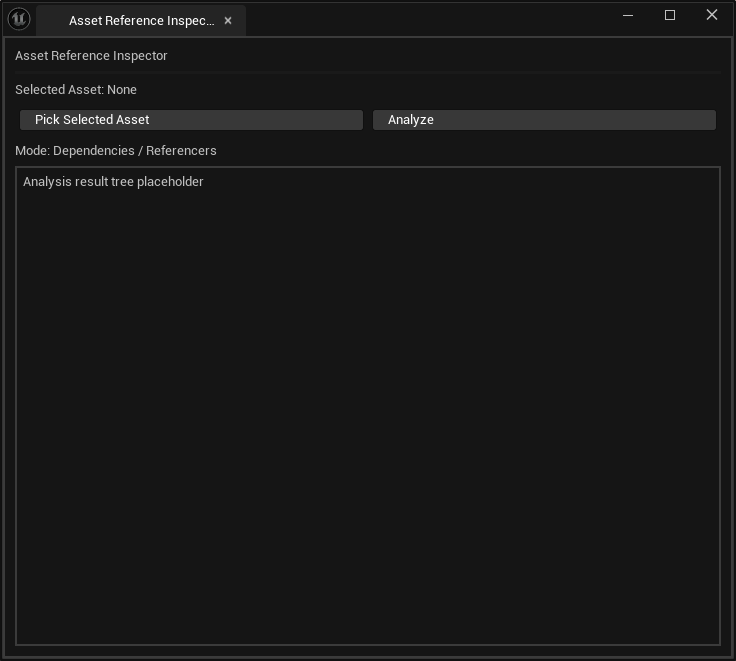

### AssetReferenceInspector STreeView 더미 데이터

#### 대상

- 프로젝트: `Portfolio_PlugIn`
- 타깃: `Portfolio_PlugInEditor`
- 플랫폼: `Win64`
- 구성: `Development`
- Engine: Unreal Engine 5.4

#### 명령

```powershell
& "C:\Program Files\Epic Games\UE_5.4\Engine\Build\BatchFiles\Build.bat" Portfolio_PlugInEditor Win64 Development -Project="C:\UE5_Portfolio\Portfolio_UE5.4_verGit\Portfolio_PlugIn\Portfolio_PlugIn.uproject" -WaitMutex -FromMsBuild
```

#### 결과

성공.

일반 실행은 UBT 로그 파일 백업 단계에서 `UnauthorizedAccessException`으로 실패했다. 동일 명령을 권한 상승으로 재실행해 실제 컴파일/링크를 확인했다.

UBT 출력 기준:

```text
[3/7] Compile [x64] Module.AssetReferenceInspector.cpp
[4/7] Compile [x64] SAssetReferenceInspectorWidget.cpp
[5/7] Link [x64] UnrealEditor-AssetReferenceInspector-0004.lib
[6/7] Link [x64] UnrealEditor-AssetReferenceInspector-0004.dll
[7/7] WriteMetadata Portfolio_PlugInEditor.target
Total execution time: 5.97 seconds
```

#### 확인 범위

- 결과 영역 placeholder를 `STreeView`로 교체한 상태에서 빌드 확인
- `BP_Player` 기준 더미 계층 데이터를 위젯 내부에서 생성하는 상태에서 빌드 확인
- `OnGenerateTreeRow`, `OnGetTreeChildren` 콜백 연결 상태에서 빌드 확인

#### 에디터 UI 확인

- `Asset Reference Inspector` 탭 내부 결과 영역이 `STreeView`로 표시됨을 확인
- `BP_Player` 루트 노드 표시 확인
- `SK_Player`, `ABP_Player`, `M_Player`, `PlayerConfig` 자식 노드 표시 확인
- `M_Player` 하위 `Player_D`, `Player_L` 노드 표시 확인
- Tree row 선택 하이라이트 표시 확인
- expand / collapse UI 표시 확인

#### Screenshots

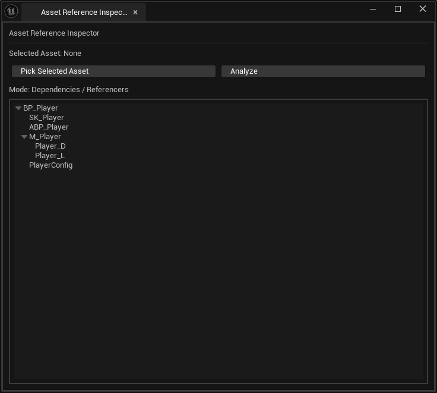

### AssetReferenceInspector Content Browser 선택 Asset 표시

#### 대상

- 프로젝트: `Portfolio_PlugIn`
- 타깃: `Portfolio_PlugInEditor`
- 플랫폼: `Win64`
- 구성: `Development`
- Engine: Unreal Engine 5.4

#### 명령

```powershell
& "C:\Program Files\Epic Games\UE_5.4\Engine\Build\BatchFiles\Build.bat" Portfolio_PlugInEditor Win64 Development -Project="C:\UE5_Portfolio\Portfolio_UE5.4_verGit\Portfolio_PlugIn\Portfolio_PlugIn.uproject" -WaitMutex -FromMsBuild
```

#### 결과

성공.

일반 실행은 UBT 로그 파일 백업 단계에서 `UnauthorizedAccessException`으로 실패했다. 동일 명령을 권한 상승으로 재실행해 실제 컴파일/링크를 확인했다.

UBT 출력 기준:

```text
[3/7] Compile [x64] Module.AssetReferenceInspector.cpp
[4/7] Compile [x64] SAssetReferenceInspectorWidget.cpp
[5/7] Link [x64] UnrealEditor-AssetReferenceInspector-0006.lib
[6/7] Link [x64] UnrealEditor-AssetReferenceInspector-0006.dll
[7/7] WriteMetadata Portfolio_PlugInEditor.target
Total execution time: 6.71 seconds
```

#### 확인 범위

- `ContentBrowser`, `AssetRegistry` private dependency 추가 상태에서 빌드 확인
- `Pick Selected Asset` 버튼에 `OnClicked` 핸들러를 연결한 상태에서 빌드 확인
- `IContentBrowserSingleton::GetSelectedAssets` 사용 상태에서 빌드 확인
- 선택 Asset 이름과 PackageName 표시용 텍스트 바인딩 상태에서 빌드 확인

#### 에디터 UI 확인

- Content Browser에서 `BP_Dummy` 선택 후 `Pick Selected Asset` 클릭 시 `Selected Asset: BP_Dummy (/Game/BP_Dummy)` 표시 확인
- Content Browser 선택 Asset이 없는 상태에서 `Pick Selected Asset` 클릭 시 `Selected Asset: None` 표시 확인
- 선택 Asset 표시 변경 후 기존 더미 `STreeView` 표시 유지 확인

#### Screenshots

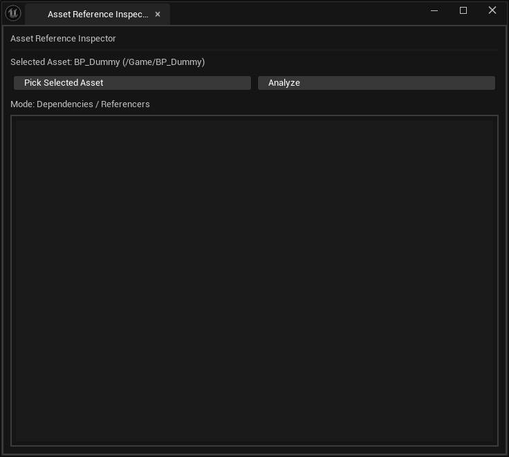

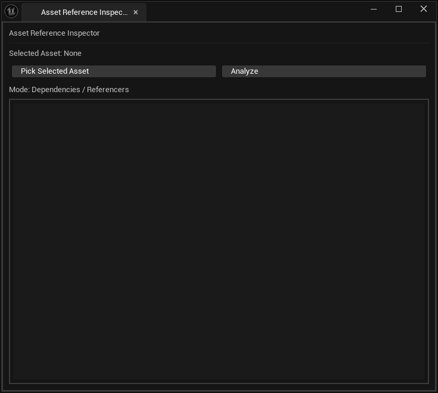

### AssetReferenceInspector Dependencies Depth 1 조회

#### 대상

- 프로젝트: `Portfolio_PlugIn`
- 타깃: `Portfolio_PlugInEditor`
- 플랫폼: `Win64`
- 구성: `Development`
- Engine: Unreal Engine 5.4

#### 명령

```powershell
& "C:\Program Files\Epic Games\UE_5.4\Engine\Build\BatchFiles\Build.bat" Portfolio_PlugInEditor Win64 Development -Project="C:\UE5_Portfolio\Portfolio_UE5.4_verGit\Portfolio_PlugIn\Portfolio_PlugIn.uproject" -WaitMutex -FromMsBuild
```

#### 결과

성공.

일반 실행은 UBT 로그 파일 백업 단계에서 `UnauthorizedAccessException`으로 실패했다. 동일 명령을 권한 상승으로 재실행해 실제 컴파일/링크를 확인했다.

UBT 출력 기준:

```text
[3/7] Compile [x64] Module.AssetReferenceInspector.cpp
[4/7] Compile [x64] SAssetReferenceInspectorWidget.cpp
[5/7] Link [x64] UnrealEditor-AssetReferenceInspector-0001.lib
[6/7] Link [x64] UnrealEditor-AssetReferenceInspector-0001.dll
[7/7] WriteMetadata Portfolio_PlugInEditor.target
Total execution time: 8.24 seconds
```

#### 확인 범위

- `Analyze` 버튼에 `OnClicked` 핸들러를 연결한 상태에서 빌드 확인
- `FAssetRegistryModule`과 `IAssetRegistry::GetDependencies` 사용 상태에서 빌드 확인
- `FAssetReferenceTreeNode` 기반 Tree View 표시 구조로 변경한 상태에서 빌드 확인
- 조회 결과를 `TreeView->RequestTreeRefresh()`로 갱신하는 상태에서 빌드 확인

#### 에디터 UI 확인

- 확인 완료.
- `BP_Dummy` 선택 후 `Pick Selected Asset`, `Analyze` 클릭 시 Tree 루트에 `BP_Dummy`가 표시되는 것을 확인했다.
- `BP_Dummy`의 Dependencies 결과에 `/Script/NavigationSystem`, `Cube`, `M_Dummy`가 표시되는 것을 확인했다.
- `M_Dummy` 선택 후 `Analyze` 클릭 시 Tree 루트에 `M_Dummy`가 표시되고, 자식 노드로 `T_Dummy_Color`가 표시되는 것을 확인했다.
- `T_Dummy_Color` 선택 후 `Analyze` 클릭 시 Tree 루트에 `T_Dummy_Color`가 표시되고, 자식 노드로 `/Script/InterchangeEngine`이 표시되는 것을 확인했다.
- 선택 Asset이 없는 상태에서 `Analyze` 클릭 시 안전하게 처리되는지는 아직 미확인이다.

#### Screenshots

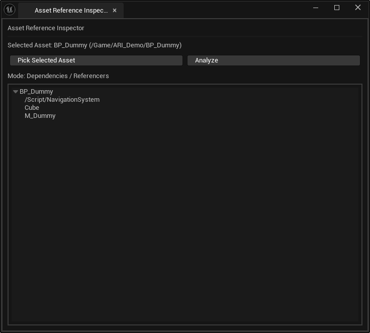

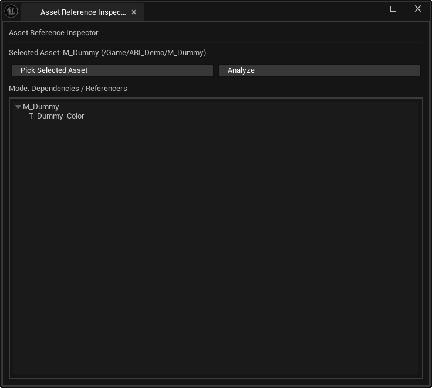

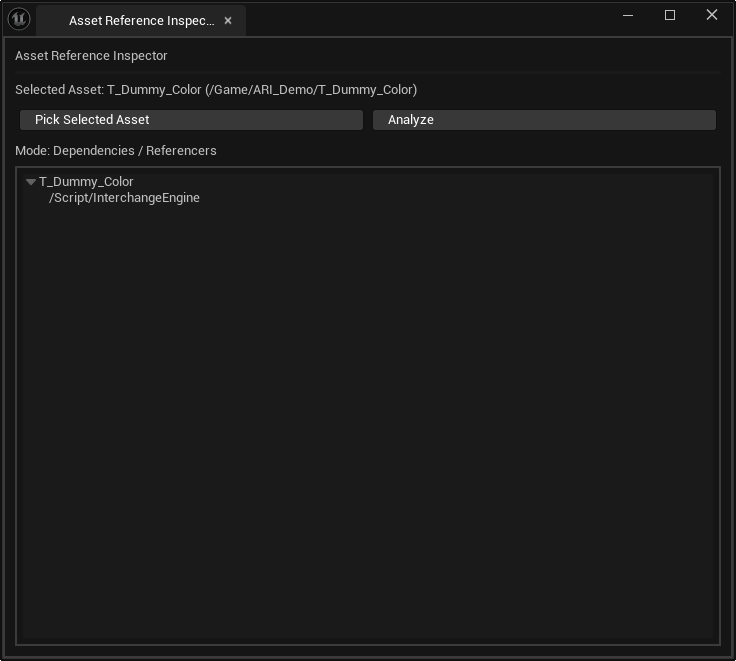

### AssetReferenceInspector Analysis Data Model 분리

#### 대상

- 프로젝트: `Portfolio_PlugIn`
- 타깃: `Portfolio_PlugInEditor`
- 플랫폼: `Win64`
- 구성: `Development`
- Engine: Unreal Engine 5.4

#### 명령

```powershell
& "C:\Program Files\Epic Games\UE_5.4\Engine\Build\BatchFiles\Build.bat" Portfolio_PlugInEditor Win64 Development -Project="C:\UE5_Portfolio\Portfolio_UE5.4_verGit\Portfolio_PlugIn\Portfolio_PlugIn.uproject" -WaitMutex -FromMsBuild
```

#### 결과

성공.

일반 실행은 UBT 로그 백업 단계에서 `UnauthorizedAccessException`으로 실패했다. 동일 명령을 권한 상승으로 재실행해 빌드 타깃이 최신 상태임을 확인했다.

UBT 출력 기준:

```text
Target is up to date
Total execution time: 0.61 seconds
```

#### 확인 범위

- `FAssetReferenceTreeNode`를 `Private/Analysis/AssetReferenceTypes.h`로 분리한 상태에서 빌드 확인
- `EAssetReferenceMode`, `FAssetReferenceAnalysisOptions` 추가 상태에서 빌드 확인
- `SAssetReferenceInspectorWidget`이 새 Analysis 타입 헤더를 include하는 상태에서 빌드 확인

#### 미확인

없음.

#### 비고

이전 링크 실패는 실행 중인 에디터가 모듈 DLL을 점유한 파일 잠금 상황으로 추정한다. 캐시 정리와 재빌드 후 권한 상승 빌드에서 타깃 최신 상태를 확인했다.

#### 에디터 UI 확인

- `BP_Dummy` 선택 후 `Pick Selected Asset`, `Analyze` 클릭 시 기존과 동일하게 `BP_Dummy` 루트와 `/Script/NavigationSystem`, `Cube`, `M_Dummy` Dependencies 표시 확인
- `M_Dummy` 선택 후 `Analyze` 클릭 시 기존과 동일하게 `T_Dummy_Color` Dependency 표시 확인
- `T_Dummy_Color` 선택 후 `Analyze` 클릭 시 기존과 동일하게 `/Script/InterchangeEngine` Dependency 표시 확인
- 이번 변경은 분석 데이터 구조 분리이므로 UI의 시각적 변화는 없음

### AssetReferenceInspector Max Depth 재귀 Tree 생성

#### 대상

- 프로젝트: `Portfolio_PlugIn`
- 타깃: `Portfolio_PlugInEditor`
- 플랫폼: `Win64`
- 구성: `Development`
- Engine: Unreal Engine 5.4

#### 명령

```powershell
& "C:\Program Files\Epic Games\UE_5.4\Engine\Build\BatchFiles\Build.bat" Portfolio_PlugInEditor Win64 Development -Project="C:\UE5_Portfolio\Portfolio_UE5.4_verGit\Portfolio_PlugIn\Portfolio_PlugIn.uproject" -WaitMutex -FromMsBuild
```

#### 결과

성공.

일반 실행은 UBT 로그 백업 단계에서 `UnauthorizedAccessException`으로 실패했다. 동일 명령을 권한 상승으로 재실행해 실제 컴파일/링크를 확인했다.

UBT 출력 기준:

```text
[1/7] Link [x64] UnrealEditor-Portfolio_PlugIn-0002.lib
[2/7] Link [x64] UnrealEditor-Portfolio_PlugIn-0002.dll
[3/7] Compile [x64] Module.AssetReferenceInspector.cpp
[4/7] Compile [x64] SAssetReferenceInspectorWidget.cpp
[5/7] Link [x64] UnrealEditor-AssetReferenceInspector-0002.lib
[6/7] Link [x64] UnrealEditor-AssetReferenceInspector-0002.dll
[7/7] WriteMetadata Portfolio_PlugInEditor.target
Total execution time: 5.93 seconds
```

#### 확인 범위

- `FAssetReferenceAnalysisOptions::MaxDepth` 기본값을 사용하는 상태에서 빌드 확인
- `BuildDependencyChildren` 재귀 Dependencies Tree 생성 상태에서 빌드 확인
- `FAssetReferenceTreeNode::Depth` 값을 노드 생성에 반영하는 상태에서 빌드 확인
- `FAssetReferenceTreeNode::bIsCircular` 값을 순환 후보 노드에 기록하는 상태에서 빌드 확인
- `/Game` Package만 표시하는 최소 필터 적용 상태에서 빌드 확인
- `SAssetReferenceInspectorWidget.h`의 helper/state 섹션을 UI callbacks, UI text, Analysis, Tree view 기준으로 정리한 상태에서 빌드 확인

#### 에디터 UI 확인

- `BP_Dummy` 선택 후 `Pick Selected Asset`, `Analyze` 클릭 시 `BP_Dummy -> M_Dummy -> T_Dummy_Color` 재귀 Tree 표시 확인
- `M_Dummy` 선택 후 `Analyze` 클릭 시 `M_Dummy -> T_Dummy_Color` 표시 확인
- `T_Dummy_Color` 선택 후 `Analyze` 클릭 시 `/Script/InterchangeEngine`이 필터링되어 root만 표시되는 것 확인
- `/Script/NavigationSystem`, `Cube`, `WorldGridMaterial`이 결과 Tree에서 제외되는 것 확인
- 순환 방어 비활성화 상태에서 `BP_CycleA -> BP_CycleB -> BP_CycleA -> BP_CycleB -> BP_CycleA`처럼 MaxDepth까지 반복 전개되는 것을 확인
- 순환 방어 활성화 상태에서 `BP_CycleA -> BP_CycleB -> BP_CycleA`까지만 표시되고, 마지막 `BP_CycleA` 아래로는 확장되지 않는 것을 확인

#### Demo Assets

- `Content/ARI_Demo/Validation/BP_CycleA.uasset`
- `Content/ARI_Demo/Validation/BP_CycleB.uasset`

두 Asset은 순환 dependency 검증 재현을 위한 Demo Host 전용 Asset이다. 플러그인 배포 단위인 `Plugins/AssetReferenceInspector`에는 포함되지 않는다.

#### Screenshots

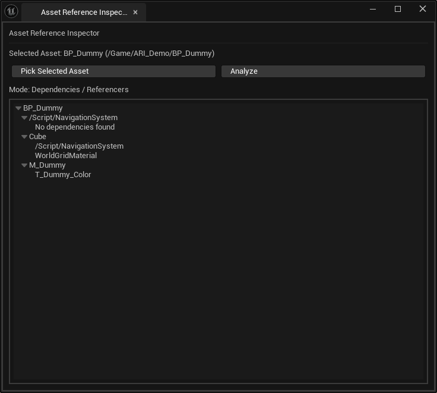

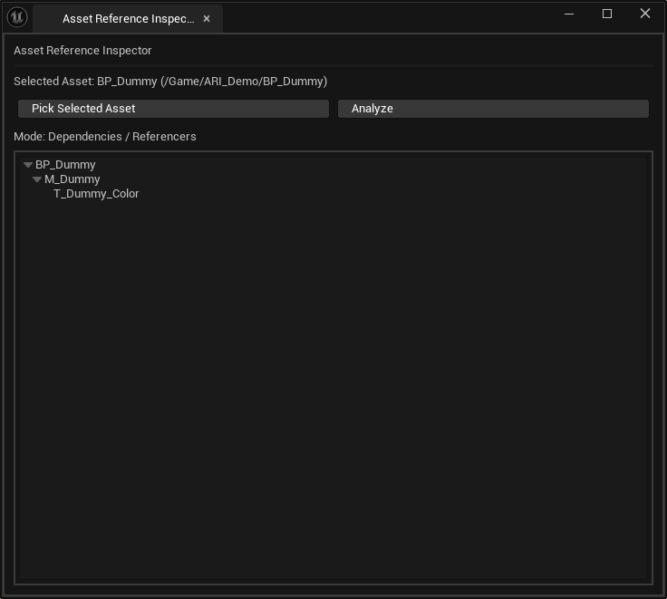

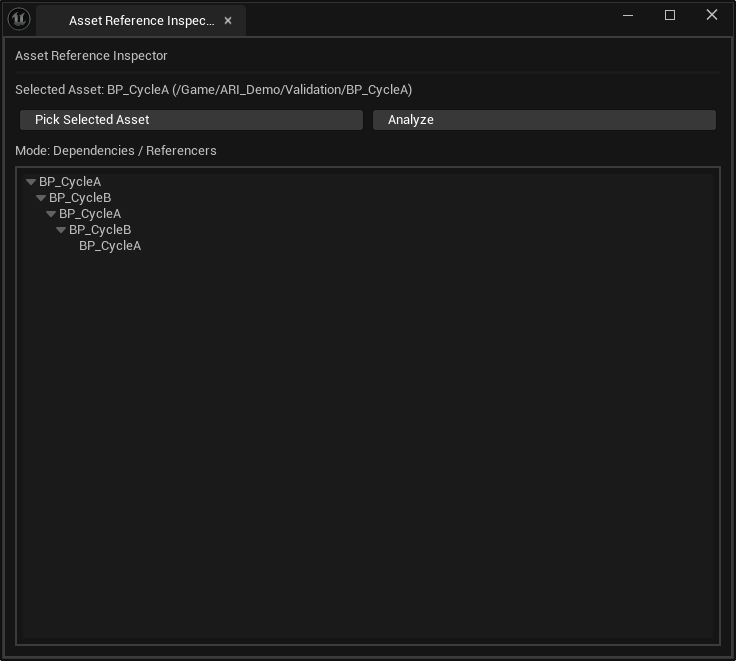

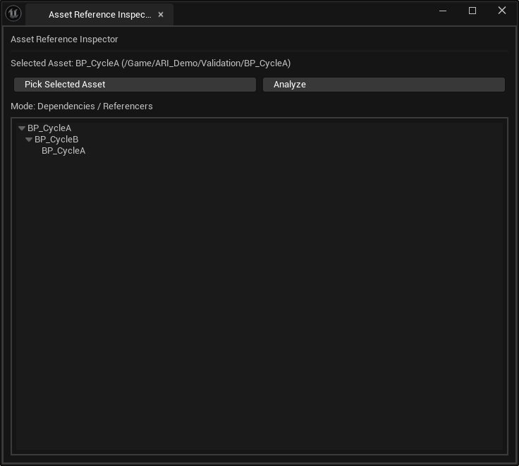

#### 미확인

- Max Depth 입력 UI는 이번 범위가 아니므로 미검증
- 정식 Engine / Plugin Content 표시 옵션은 이번 범위가 아니므로 미검증

### AssetReferenceInspector Referencers 모드 추가

#### 대상

- 프로젝트: `Portfolio_PlugIn`
- 타깃: `Portfolio_PlugInEditor`
- 플랫폼: `Win64`
- 구성: `Development`
- Engine: Unreal Engine 5.4

#### 명령

```powershell
& "C:\Program Files\Epic Games\UE_5.4\Engine\Build\BatchFiles\Build.bat" Portfolio_PlugInEditor Win64 Development -Project="C:\UE5_Portfolio\Portfolio_UE5.4_verGit\Portfolio_PlugIn\Portfolio_PlugIn.uproject" -WaitMutex -FromMsBuild
```

#### 결과

성공.

일반 실행은 UBT 로그 백업 단계에서 `UnauthorizedAccessException`으로 실패했다. 동일 명령을 권한 상승으로 재실행해 실제 컴파일/링크를 확인했다. 내부 처리 함수명을 `Relation` 계열로 정리한 뒤 같은 명령으로 재검증했다.

최종 재검증 UBT 출력 기준:

```text
[3/7] Compile [x64] Module.AssetReferenceInspector.cpp
[4/7] Compile [x64] SAssetReferenceInspectorWidget.cpp
[5/7] Link [x64] UnrealEditor-AssetReferenceInspector-0001.lib
[6/7] Link [x64] UnrealEditor-AssetReferenceInspector-0001.dll
[7/7] WriteMetadata Portfolio_PlugInEditor.target
Total execution time: 4.60 seconds
```

#### 확인 범위

- `EAssetReferenceMode`를 실제 분석 분기 조건으로 사용하는 상태에서 빌드 확인
- `GetRelatedPackageNames`에서 `GetDependencies` / `GetReferencers`를 분기하는 상태에서 빌드 확인
- Dependencies / Referencers가 같은 Tree Node 모델과 재귀 생성 흐름을 사용하는 상태에서 빌드 확인
- 내부 처리 함수명을 `Relation` 계열로 정리한 상태에서 빌드 확인
- 최소 Mode 전환 UI가 포함된 상태에서 빌드 확인

#### 에디터 UI 확인

- `BP_Dummy` 선택 후 `Dependencies` 모드에서 `Analyze` 클릭 시 `BP_Dummy -> M_Dummy -> T_Dummy_Color` 표시 확인
- `M_Dummy` 선택 후 `Referencers` 모드에서 `Analyze` 클릭 시 `M_Dummy -> BP_Dummy` 표시 확인
- `T_Dummy_Color` 선택 후 `Referencers` 모드에서 `Analyze` 클릭 시 `T_Dummy_Color -> M_Dummy -> BP_Dummy` 표시 확인
- Mode 버튼 클릭 시 `Mode: Dependencies` / `Mode: Referencers` 표시가 전환되는 것 확인

#### Screenshots

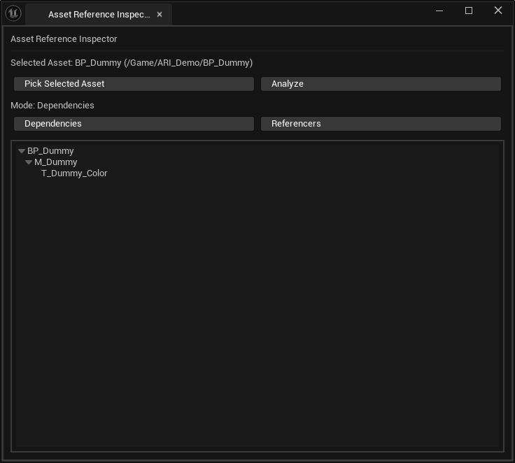

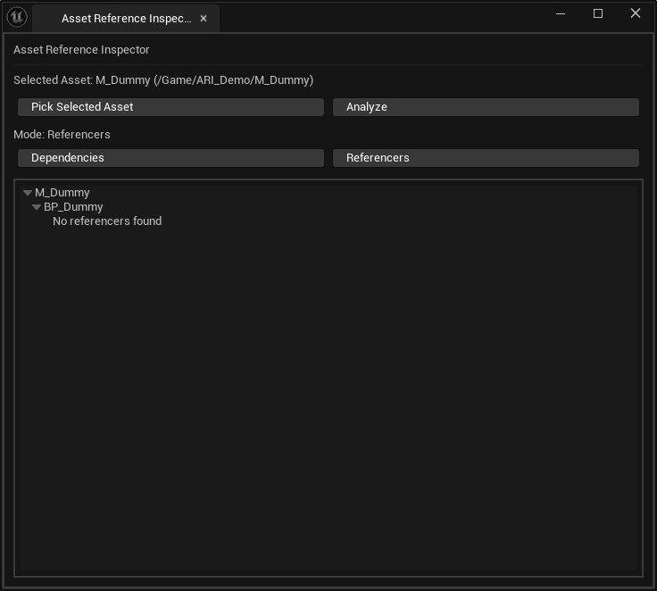


#### 미확인

- Max Depth 입력 UI는 이번 범위가 아니므로 미검증
- 정식 Engine / Plugin Content 표시 옵션은 이번 범위가 아니므로 미검증
- Content Browser Sync는 이번 범위가 아니므로 미검증

### AssetReferenceInspector Content Browser Sync 추가

#### 대상

- 프로젝트: `Portfolio_PlugIn`
- 타깃: `Portfolio_PlugInEditor`
- 플랫폼: `Win64`
- 구성: `Development`
- Engine: Unreal Engine 5.4

#### 명령

```powershell
& "C:\Program Files\Epic Games\UE_5.4\Engine\Build\BatchFiles\Build.bat" Portfolio_PlugInEditor Win64 Development -Project="C:\UE5_Portfolio\Portfolio_UE5.4_verGit\Portfolio_PlugIn\Portfolio_PlugIn.uproject" -WaitMutex -FromMsBuild
```

#### 결과

성공.

UBT 출력 기준:

```text
[1/5] Compile [x64] Module.AssetReferenceInspector.cpp
[2/5] Compile [x64] SAssetReferenceInspectorWidget.cpp
[3/5] Link [x64] UnrealEditor-AssetReferenceInspector.lib
[4/5] Link [x64] UnrealEditor-AssetReferenceInspector.dll
[5/5] WriteMetadata Portfolio_PlugInEditor.target
Total execution time: 6.86 seconds
```

헤더/소스 섹션 정리와 검증 로그 보완 이후 동일 명령으로 재검증했다.

최종 재검증 UBT 출력 기준:

```text
Target is up to date
Total execution time: 0.58 seconds
```

#### 확인 범위

- `STreeView` 더블 클릭 콜백을 연결한 상태에서 빌드 확인
- Tree Node PackageName으로 `FAssetData`를 재조회하는 상태에서 빌드 확인
- 유효한 AssetData에 대해 `IContentBrowserSingleton::SyncBrowserToAssets`를 호출하는 상태에서 빌드 확인
- AssetData가 없는 PackageName은 실패 없이 무시하는 상태에서 빌드 확인

#### 에디터 UI 확인

- `BP_Dummy` 분석 결과에서 `M_Dummy` 노드 더블 클릭 시 Content Browser가 `M_Dummy`를 선택하는 것 확인
- `BP_Dummy` 분석 결과에서 `T_Dummy_Color` 노드 더블 클릭 시 Content Browser가 `T_Dummy_Color`를 선택하는 것 확인
- Referencers 모드에서 `BP_Dummy` 노드 더블 클릭 시 Content Browser가 `BP_Dummy`를 선택하는 것 확인
- `No dependencies found` placeholder 노드 더블 클릭 시 별도 오류 없이 무시되는 것 확인
- `No referencers found` placeholder 노드 더블 클릭 시 별도 오류 없이 무시되는 것 확인
- 검증을 위해 `/Game` 최소 필터를 일시 해제한 상태에서 `/Script/InterchangeEngine` Package 노드 더블 클릭 시 별도 오류 없이 무시되는 것 확인

#### Screenshots

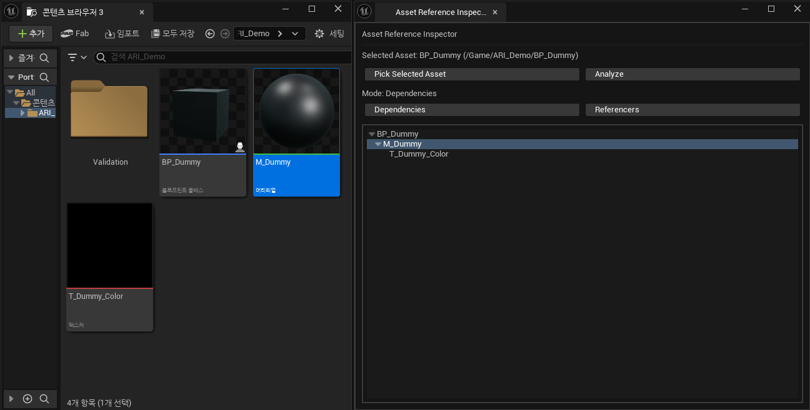

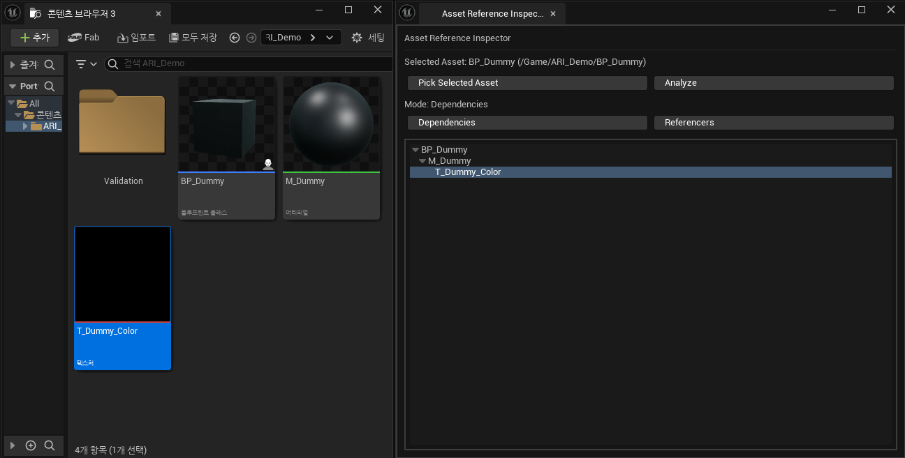

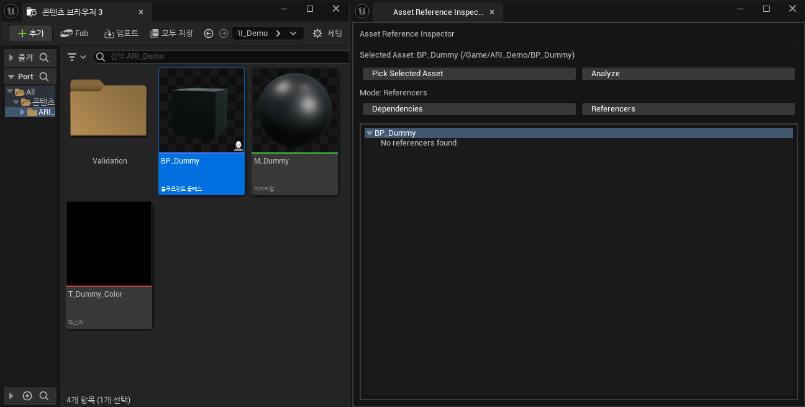

#### 미확인

- 필터링 이후 표시 결과가 비어 있는 경우의 메시지 정책은 Phase 5 필터 작업에서 정리

### AssetReferenceInspector Path 필터 추가

#### 대상

- 프로젝트: `Portfolio_PlugIn`
- 타깃: `Portfolio_PlugInEditor`
- 플랫폼: `Win64`
- 구성: `Development`
- Engine: Unreal Engine 5.4

#### 명령

```powershell
& "C:\Program Files\Epic Games\UE_5.4\Engine\Build\BatchFiles\Build.bat" Portfolio_PlugInEditor Win64 Development -Project="C:\UE5_Portfolio\Portfolio_UE5.4_verGit\Portfolio_PlugIn\Portfolio_PlugIn.uproject" -WaitMutex -FromMsBuild
```

#### 결과

성공.

UBT 출력 기준:

```text
[1/5] Compile [x64] Module.AssetReferenceInspector.cpp
[2/5] Compile [x64] SAssetReferenceInspectorWidget.cpp
[3/5] Link [x64] UnrealEditor-AssetReferenceInspector.lib
[4/5] Link [x64] UnrealEditor-AssetReferenceInspector.dll
[5/5] WriteMetadata Portfolio_PlugInEditor.target
Total execution time: 6.00 seconds
```

Path Filter Enter commit 처리 수정 후 동일 명령으로 재검증했다.

최종 재검증 UBT 출력 기준:

```text
[3/6] Compile [x64] SAssetReferenceInspectorWidget.cpp
[4/6] Link [x64] UnrealEditor-AssetReferenceInspector-0001.lib
[5/6] Link [x64] UnrealEditor-AssetReferenceInspector-0001.dll
[6/6] WriteMetadata Portfolio_PlugInEditor.target
Total execution time: 4.90 seconds
```

#### 확인 범위

- `FAssetReferenceAnalysisOptions::PathFilter` 기본값 `/Game/` 추가 상태에서 빌드 확인
- `SEditableTextBox` 기반 Path Filter 입력 UI 추가 상태에서 빌드 확인
- Path Filter commit callback에서 입력값을 trim해 분석 옵션에 저장하는 상태에서 빌드 확인
- `ShouldIncludeRelatedPackage`가 고정 `/Game/` 대신 현재 Path Filter 값으로 PackageName을 판정하는 상태에서 빌드 확인
- Path Filter 적용 후 표시 가능한 자식이 없으면 현재 모드의 empty relation placeholder를 추가하는 상태에서 빌드 확인
- `OnTextCommitted`에서 `ETextCommit::OnCleared`가 들어오면 기존 Path Filter 상태를 덮어쓰지 않는 상태에서 빌드 확인

#### 에디터 UI 확인

- Path Filter에 `/Game/` 입력 후 `Analyze` 클릭 시 `/Game/` 기준으로 결과가 표시되는 것 확인
- Path Filter에 `/Script/` 입력 후 `Analyze` 클릭 시 `/Script/` 기준으로 결과가 표시되는 것 확인
- Path Filter를 빈 값으로 둔 뒤 `Analyze` 클릭 시 `/Game`, `/Script`, Engine 기본 Asset 관계가 함께 표시되는 것 확인
- Path Filter에 `/NoMatch/` 입력 후 `Analyze` 클릭 시 표시 가능한 자식이 없어 `No dependencies found` placeholder가 표시되는 것 확인
- Path Filter 입력 후 `Enter`를 누르면 `OnEnter` 뒤에 `OnCleared`가 추가로 호출되는 것을 로그로 확인
- Enter는 `OnEnter`로 commit된 뒤, commit 후 키보드 포커스 clear 경로에서 `OnCleared`가 추가 호출되는 것으로 해석
- `Analyze` 버튼 클릭은 마우스 포커스 이동이므로 `OnUserMovedFocus`로 호출되는 것을 로그로 확인
- `OnCleared`를 무시하도록 수정해 Enter 입력 후 Path Filter 값이 빈 문자열로 덮이지 않도록 조치

#### Commit 로그 확인

```text
/Game/ 입력 후 Enter:
CommitType=1, Text='/Game/'
CommitType=3, Text='/Game/'

/Game/ 입력 후 Analyze 버튼 클릭:
CommitType=2, Text='/Game/'

/Script/ 입력 후 Enter:
CommitType=1, Text='/Script/'
CommitType=3, Text='/Script/'

텍스트 전체 삭제 후 Enter:
CommitType=1, Text=''
CommitType=3, Text=''
```

#### Screenshots

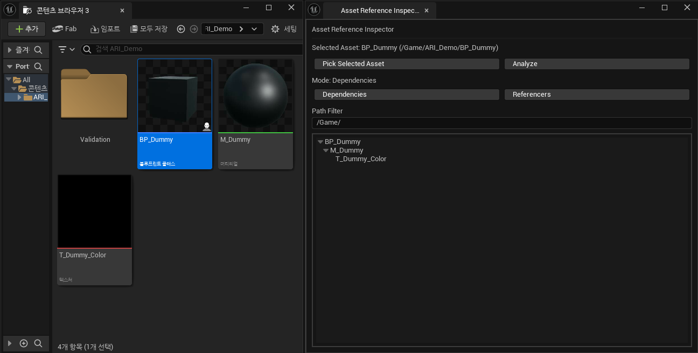

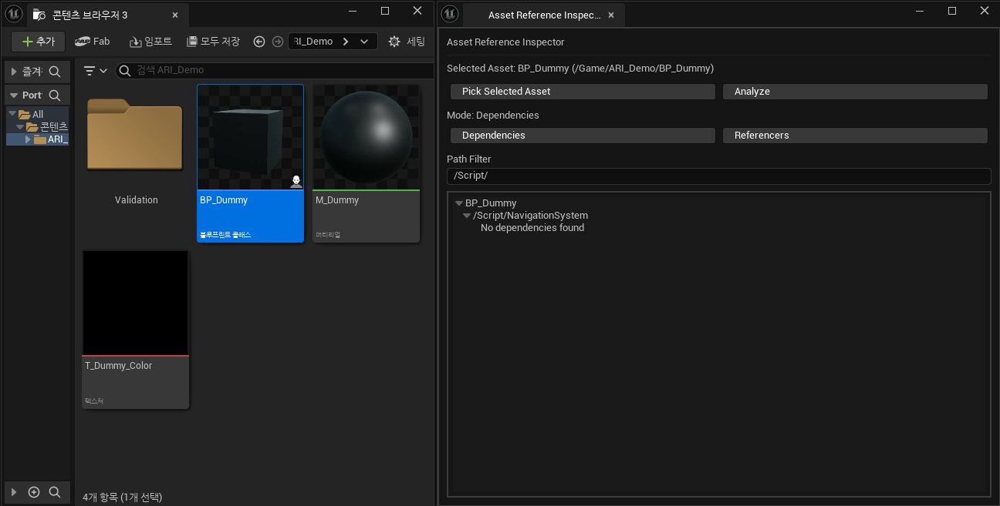

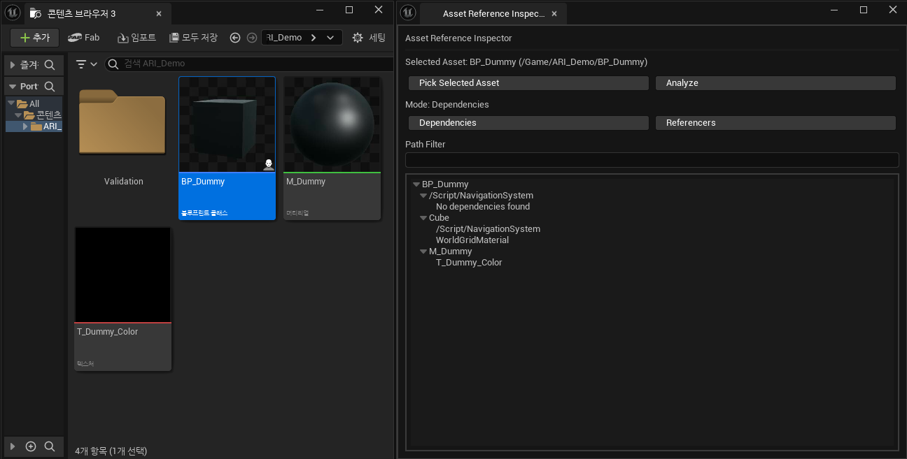


#### 미확인

없음.

### AssetReferenceInspector Asset Class 필터 추가

#### 대상

- 프로젝트: `Portfolio_PlugIn`
- 타깃: `Portfolio_PlugInEditor`
- 플랫폼: `Win64`
- 구성: `Development`
- Engine: Unreal Engine 5.4

#### 명령

```powershell
& "C:\Program Files\Epic Games\UE_5.4\Engine\Build\BatchFiles\Build.bat" Portfolio_PlugInEditor Win64 Development -Project="C:\UE5_Portfolio\Portfolio_UE5.4_verGit\Portfolio_PlugIn\Portfolio_PlugIn.uproject" -WaitMutex -FromMsBuild
```

#### 결과

성공.

UBT 출력 기준:

```text
[3/6] Compile [x64] Module.AssetReferenceInspector.cpp
[4/6] Link [x64] UnrealEditor-AssetReferenceInspector-0008.lib
[5/6] Link [x64] UnrealEditor-AssetReferenceInspector-0008.dll
[6/6] WriteMetadata Portfolio_PlugInEditor.target
Total execution time: 6.42 seconds
```

#### 확인 범위

- `FAssetReferenceAnalysisOptions::ClassFilter` 추가 상태에서 빌드 확인
- `SEditableTextBox` 기반 Class Filter 입력 UI 추가 상태에서 빌드 확인
- Class Filter commit callback에서 입력값을 trim해 분석 옵션에 저장하는 상태에서 빌드 확인
- 관계 PackageName을 `FAssetData`로 해석해 `AssetClassPath` 기준으로 필터링하는 상태에서 빌드 확인
- `ShouldPassRelationFilters`가 Path Filter와 Class Filter를 함께 적용하는 상태에서 빌드 확인
- Tree row에 `DisplayName [ClassName]` 형식으로 Asset Class가 표시되는 상태에서 빌드 확인

#### 에디터 UI 확인

- Class Filter 빈 값, Path Filter `/Game/`, Dependencies 모드에서 `BP_Dummy [Blueprint] -> M_Dummy [Material] -> T_Dummy_Color [Texture2D]` 표시 확인
- Class Filter `Material`, Path Filter `/Game/`, Dependencies 모드에서 `M_Dummy [Material]` 표시 확인
- Class Filter `Texture2D`, Path Filter `/Game/`, Dependencies 모드에서 중간 노드 `M_Dummy [Material]`이 필터에서 탈락해 root 아래 `No dependencies found` placeholder 표시 확인
- `Texture2D` 검증은 현재 strict filter 정책상 하위 매칭 노드가 있어도 중간 노드가 필터에서 탈락하면 더 내려가지 않는 것을 확인하기 위한 항목
- Class Filter `Blueprint`, Path Filter `/Game/`, Referencers 모드에서 `M_Dummy [Material] -> BP_Dummy [Blueprint]` 표시 확인

#### Screenshots


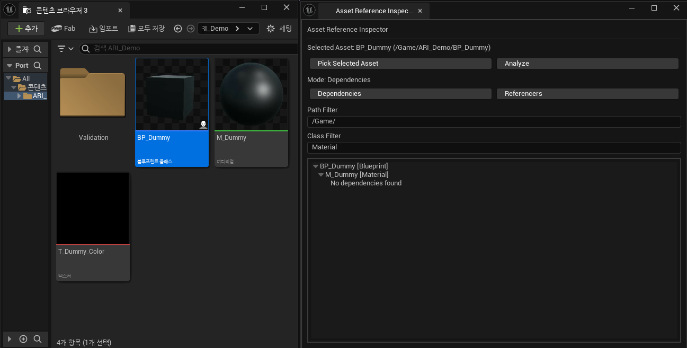

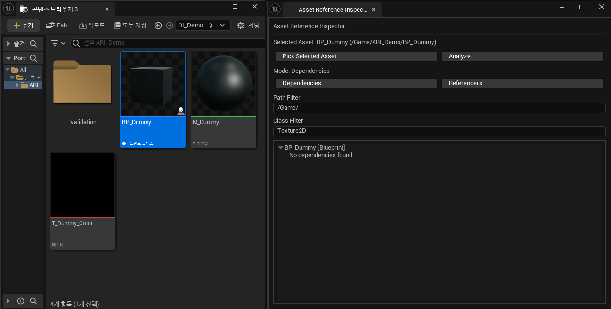

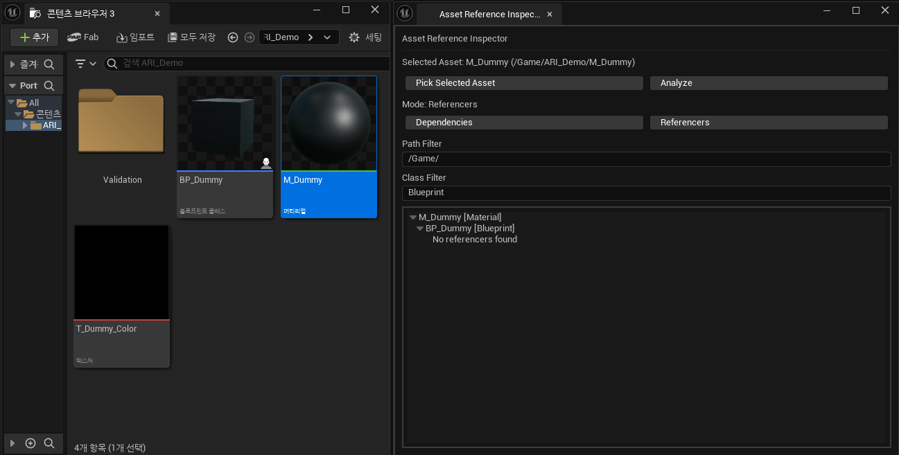

#### 미확인

- 하위에 매칭 노드가 있을 때 직접 매칭되지 않은 부모를 흐리게 표시하는 context-preserving filter mode는 후속 UX 개선 범위로 남김

### AssetReferenceInspector Engine / Plugin Content 옵션 추가

#### 대상

- 프로젝트: `Portfolio_PlugIn`
- 타깃: `Portfolio_PlugInEditor`
- 플랫폼: `Win64`
- 구성: `Development`
- Engine: Unreal Engine 5.4

#### 명령

```powershell
& "C:\Program Files\Epic Games\UE_5.4\Engine\Build\BatchFiles\Build.bat" Portfolio_PlugInEditor Win64 Development -Project="C:\UE5_Portfolio\Portfolio_UE5.4_verGit\Portfolio_PlugIn\Portfolio_PlugIn.uproject" -WaitMutex -FromMsBuild
```

#### 결과

성공.

UBT 출력 기준:

```text
Target is up to date
Total execution time: 0.63 seconds
```

#### 확인 범위

- `FAssetReferenceAnalysisOptions`에 Engine / Plugin Content 포함 옵션이 추가된 상태에서 빌드 확인
- `Include External Content` 라벨과 `Engine Content`, `Plugin Content` 체크박스 UI 추가 상태에서 빌드 확인
- `Engine Content` 체크 상태가 `/Engine/` Package 표시 여부에 반영되는 상태에서 빌드 확인
- `Plugin Content` 체크 상태가 Content를 가진 활성 플러그인의 mounted asset path 표시 여부에 반영되는 상태에서 빌드 확인
- 기본 Path Filter `/Game/` 상태에서도 Engine / Plugin Content 체크 시 해당 외부 Content root를 통과시키는 상태에서 빌드 확인

#### 에디터 UI 확인

- `Engine Content`, `Plugin Content` 모두 해제 상태에서 `BP_Dummy [Blueprint] -> M_Dummy [Material] -> T_Dummy_Color [Texture2D]`만 표시되는 것 확인
- `Engine Content` 체크 시 `Cube [StaticMesh]`, `WorldGridMaterial [Material]` 같은 Engine 기본 Asset 관계가 추가 표시되는 것 확인
- `Plugin Content` 체크 UI는 표시되고 상태 변경이 가능함을 확인
- 현재 `BP_Dummy` fixture에는 plugin-mounted asset dependency가 없어 Plugin Content positive 표시 검증은 미확인
- 세 스크린샷 모두 `Include External Content` 라벨과 두 체크박스가 표시되는 것을 확인

#### Screenshots


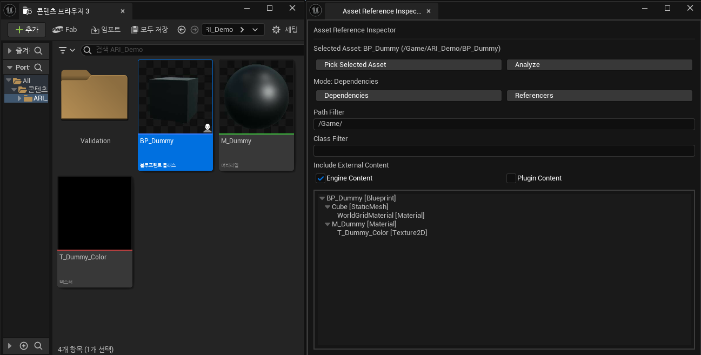

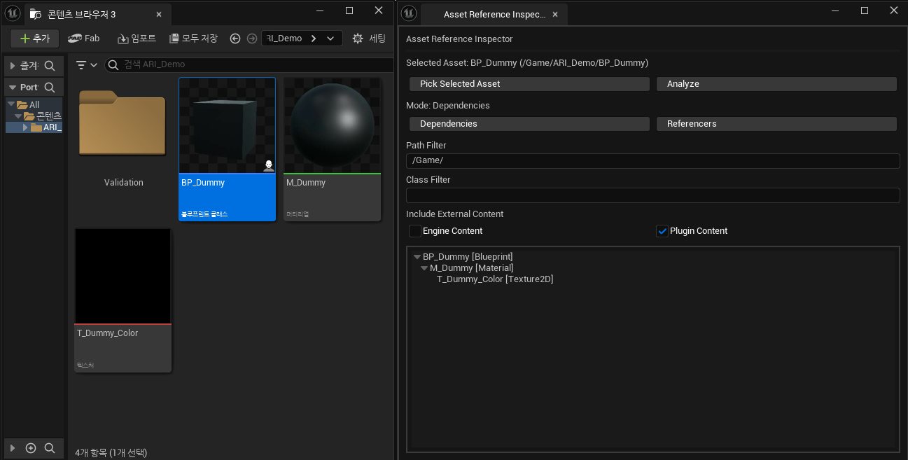

#### 미확인

- Plugin Content positive 표시 검증은 Content mount를 가진 테스트 플러그인 Asset dependency fixture가 없어 미확인

### AssetReferenceInspector Filter Predicate 분리

#### 대상

- 프로젝트: `Portfolio_PlugIn`
- 타깃: `Portfolio_PlugInEditor`
- 플랫폼: `Win64`
- 구성: `Development`
- Engine: Unreal Engine 5.4

#### 명령

```powershell
& "C:\Program Files\Epic Games\UE_5.4\Engine\Build\BatchFiles\Build.bat" Portfolio_PlugInEditor Win64 Development -Project="C:\UE5_Portfolio\Portfolio_UE5.4_verGit\Portfolio_PlugIn\Portfolio_PlugIn.uproject" -WaitMutex -FromMsBuild
```

#### 결과

성공.

UBT 출력 기준:

```text
[1/5] Compile [x64] AssetReferenceFilter.cpp
[2/5] Compile [x64] SAssetReferenceInspectorWidget.cpp
[3/5] Link [x64] UnrealEditor-AssetReferenceInspector.lib
[4/5] Link [x64] UnrealEditor-AssetReferenceInspector.dll
[5/5] WriteMetadata Portfolio_PlugInEditor.target
Total execution time: 4.70 seconds
```

#### 확인 범위

- `Private/Analysis/AssetReferenceFilter.h/.cpp` 추가 상태에서 빌드 확인
- `SAssetReferenceInspectorWidget`이 filter predicate 세부 구현을 직접 보유하지 않는 상태에서 빌드 확인
- Tree 생성 중 `FAssetReferenceFilter::ShouldPassRelationFilters`를 호출하는 상태에서 빌드 확인
- Path / Class / Engine Content / Plugin Content 판정이 Analysis 계층으로 이동한 상태에서 빌드 확인

#### 에디터 UI 확인

- 기본 Project Content 관계 표시 유지 확인
- Path Filter 결과 유지 확인
- Class Filter 결과 유지 확인
- Engine Content 옵션 결과 유지 확인
- Plugin Content 옵션 UI와 제한사항 유지 확인

#### Screenshots

- 없음. 이번 작업은 filter predicate 위치를 분리하는 리팩토링이며, 화면상 신규 UI가 없다.

#### 미확인

- Plugin Content positive 표시 검증은 Content mount를 가진 테스트 플러그인 Asset dependency fixture가 없어 기존과 동일하게 미확인

### AssetReferenceInspector Analysis Options UI 정리

#### 대상

- 프로젝트: `Portfolio_PlugIn`
- 타깃: `Portfolio_PlugInEditor`
- 플랫폼: `Win64`
- 구성: `Development`
- Engine: Unreal Engine 5.4

#### 명령

```powershell
& "C:\Program Files\Epic Games\UE_5.4\Engine\Build\BatchFiles\Build.bat" Portfolio_PlugInEditor Win64 Development -Project="C:\UE5_Portfolio\Portfolio_UE5.4_verGit\Portfolio_PlugIn\Portfolio_PlugIn.uproject" -WaitMutex -FromMsBuild
```

#### 결과

성공.

UBT 출력 기준:

```text
[3/6] Compile [x64] SAssetReferenceInspectorWidget.cpp
[4/6] Link [x64] UnrealEditor-AssetReferenceInspector-0004.lib
[5/6] Link [x64] UnrealEditor-AssetReferenceInspector-0004.dll
[6/6] WriteMetadata Portfolio_PlugInEditor.target
Total execution time: 7.31 seconds
```

#### 확인 범위

- Analysis Options 영역이 `Mode`, `Filters`, `Content Scope` 섹션으로 구분된 상태에서 빌드 확인
- `Filters` 섹션이 `SGridPanel` 기반 label / input 2열 구조로 표시되는 상태에서 빌드 확인
- Max Depth 입력 UI가 `AnalysisOptions.MaxDepth`에 연결된 상태에서 빌드 확인
- Max Depth 입력값이 0~10 범위로 clamp되는 코드 경로에서 빌드 확인
- Mode 버튼의 선택 상태가 child `STextBlock` font binding으로 표시되는 상태에서 빌드 확인
- Slate 위젯 트리 갱신과 attribute 호출 메커니즘 문서 보강 상태에서 빌드 확인

#### 에디터 UI 확인

- 기본 상태에서 Analysis Options가 `Mode`, `Filters`, `Content Scope`로 계층 구분되어 표시되는 것 확인
- Max Depth `0` 입력 시 root Asset만 표시되는 것 확인
- Max Depth `1` 입력 시 root의 1-depth 관계까지만 표시되는 것 확인
- Max Depth `2` 입력 시 `BP_Dummy [Blueprint] -> M_Dummy [Material] -> T_Dummy_Color [Texture2D]`까지 표시되는 것 확인
- Max Depth에 `10`보다 큰 값을 입력하고 commit하면 `10`으로 보정되어 적용되는 것 확인
- Referencers 모드 선택 시 `Referencers` 버튼 텍스트가 bold 처리되고, referencer 관계가 표시되는 것 확인

#### Screenshots

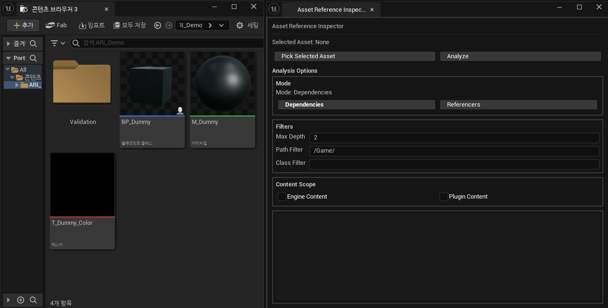

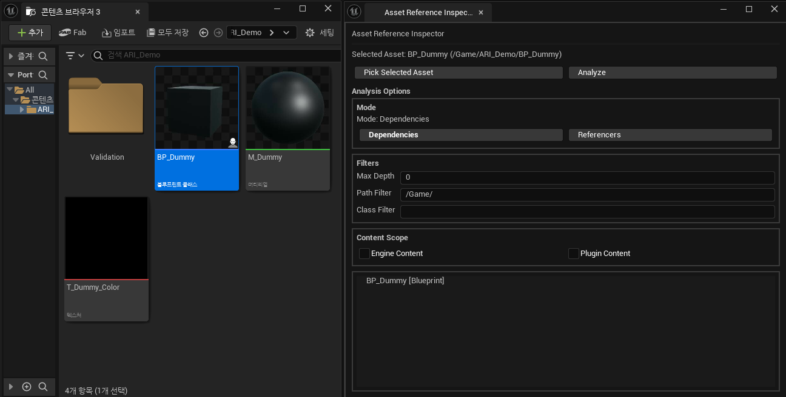


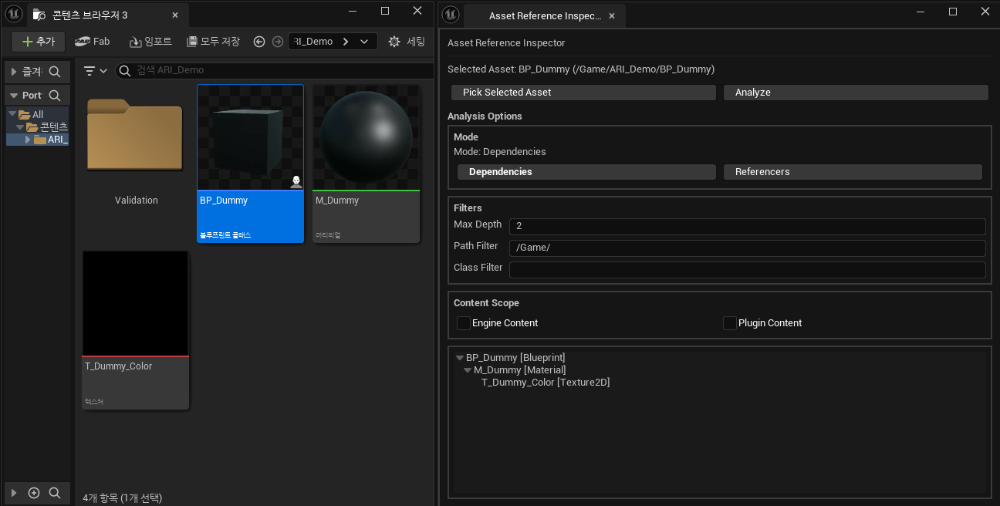

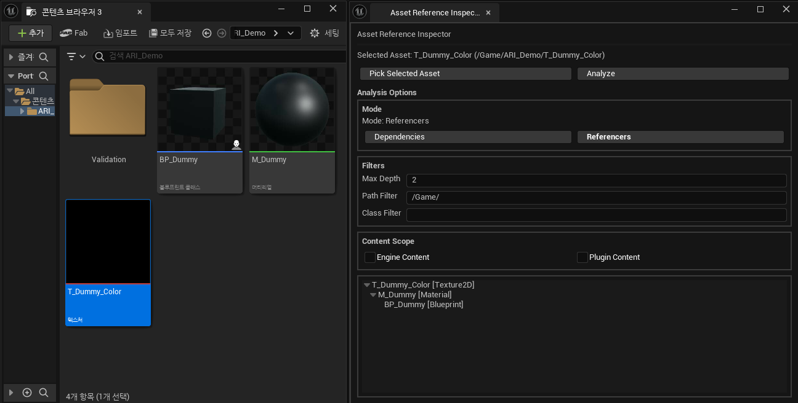

#### 미확인

- Plugin Content positive 표시 검증은 Content mount를 가진 테스트 플러그인 Asset dependency fixture가 없어 기존과 동일하게 미확인

### AssetReferenceInspector Circular Reference Indicator

#### 대상

- 프로젝트: `Portfolio_PlugIn`
- 타깃: `Portfolio_PlugInEditor`
- 플랫폼: `Win64`
- 구성: `Development`
- Engine: Unreal Engine 5.4

#### 명령

```powershell
& "C:\Program Files\Epic Games\UE_5.4\Engine\Build\BatchFiles\Build.bat" Portfolio_PlugInEditor Win64 Development -Project="C:\UE5_Portfolio\Portfolio_UE5.4_verGit\Portfolio_PlugIn\Portfolio_PlugIn.uproject" -WaitMutex -FromMsBuild
```

#### 결과

성공.

UBT 출력 기준:

```text
[3/6] Compile [x64] Module.AssetReferenceInspector.cpp
[4/6] Link [x64] UnrealEditor-AssetReferenceInspector-0001.lib
[5/6] Link [x64] UnrealEditor-AssetReferenceInspector-0001.dll
[6/6] WriteMetadata Portfolio_PlugInEditor.target
Total execution time: 6.98 seconds
```

#### 확인 범위

- `FAssetReferenceTreeNode::bIsCircular` 값을 Tree row 표시 문자열에 반영하는 상태에서 빌드 확인
- 순환 후보 노드에 `[Circular]` suffix를 붙이는 `GetTreeNodeDisplayText` 경로에서 빌드 확인
- 순환 후보 노드는 Tree에 표시하되 하위 확장은 중단하는 기존 정책과 함께 빌드 확인
- 관련 Architecture / Slate UI 문서가 현재 구현 상태를 설명하도록 갱신

#### 에디터 UI 확인

- `BP_CycleA` 선택 후 Dependencies 모드에서 `BP_CycleA [Blueprint] -> BP_CycleB [Blueprint] -> BP_CycleA [Blueprint] [Circular]` 표시 확인
- 마지막 `BP_CycleA [Blueprint] [Circular]` 아래로 다시 `BP_CycleB`가 확장되지 않는 것 확인
- Content Browser에서 순환 검증용 `BP_CycleA`, `BP_CycleB` Demo Asset이 `ARI_Demo/Validation` 아래에 있는 것 확인

#### Screenshots

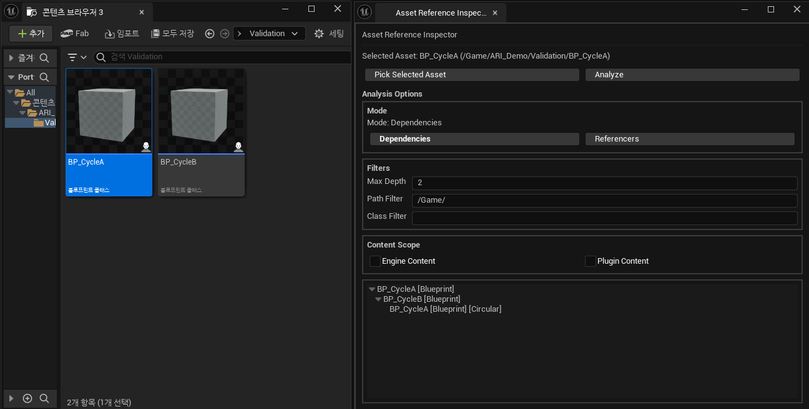

#### 미확인

- 없음

### AssetReferenceInspector Asset Size Display

#### 대상

- 프로젝트: `Portfolio_PlugIn`
- 타깃: `Portfolio_PlugInEditor`
- 플랫폼: `Win64`
- 구성: `Development`
- Engine: Unreal Engine 5.4

#### 명령

```powershell
& "C:\Program Files\Epic Games\UE_5.4\Engine\Build\BatchFiles\Build.bat" Portfolio_PlugInEditor Win64 Development -Project="C:\UE5_Portfolio\Portfolio_UE5.4_verGit\Portfolio_PlugIn\Portfolio_PlugIn.uproject" -WaitMutex -FromMsBuild
```

#### 결과

성공.

UBT 출력 기준:

```text
[1/5] Compile [x64] Module.AssetReferenceInspector.cpp
[2/5] Compile [x64] SAssetReferenceInspectorWidget.cpp
[3/5] Link [x64] UnrealEditor-AssetReferenceInspector.lib
[4/5] Link [x64] UnrealEditor-AssetReferenceInspector.dll
[5/5] WriteMetadata Portfolio_PlugInEditor.target
Total execution time: 7.17 seconds
```

#### 확인 범위

- `FAssetReferenceTreeNode::SizeBytes`를 추가한 상태에서 빌드 확인
- PackageName을 local package filename으로 변환해 `.uasset` 또는 `.umap` 크기를 조회하는 코드 경로에서 빌드 확인
- 같은 base의 `.uexp`, `.ubulk`가 있으면 크기를 합산하는 코드 경로에서 빌드 확인
- Tree row 표시 문자열이 `DisplayName [ClassName] (Size) [Circular]` 순서로 구성되는 상태에서 빌드 확인
- 관련 Feature Work Plan / Architecture / Slate UI 문서가 현재 구현 상태를 설명하도록 갱신

#### 에디터 UI 확인

- `BP_Dummy [Blueprint] (28.35 KB) -> M_Dummy [Material] (11.22 KB) -> T_Dummy_Color [Texture2D] (10.02 KB)` 표시 확인
- Path Filter를 비운 상태에서 `/Script/NavigationSystem`과 `No dependencies found` row에는 size suffix가 표시되지 않는 것 확인
- `BP_CycleA [Blueprint] (31.12 KB) -> BP_CycleB [Blueprint] (31.12 KB) -> BP_CycleA [Blueprint] (31.12 KB) [Circular]` 표시 확인
- 순환 후보 row에서 size suffix와 `[Circular]` suffix가 함께 표시되고, 마지막 순환 후보 노드 아래로 다시 확장되지 않는 것 확인

#### Screenshots

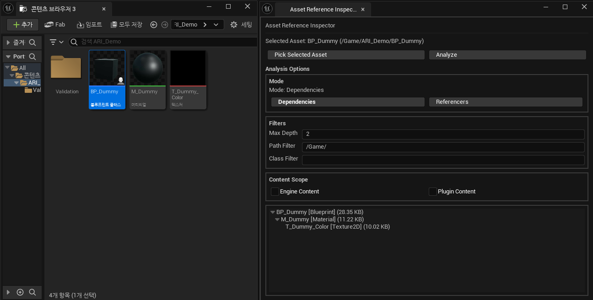

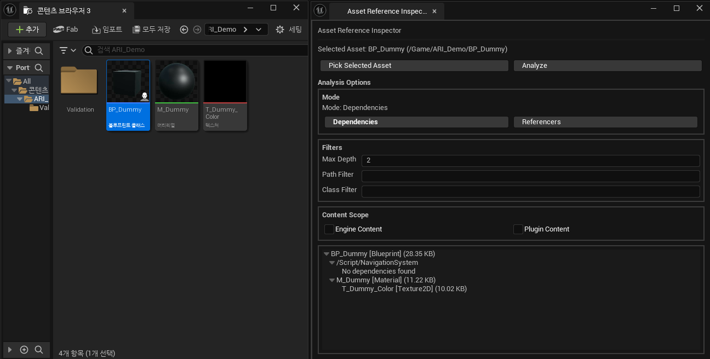

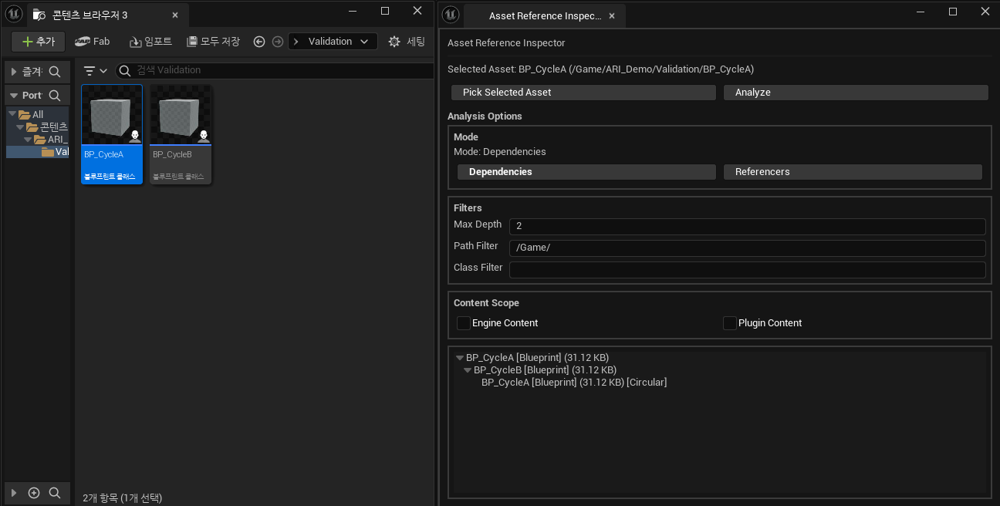

#### 미확인

- Cooked size, runtime memory size, dependency inclusive size는 이번 범위에서 검증하지 않음
